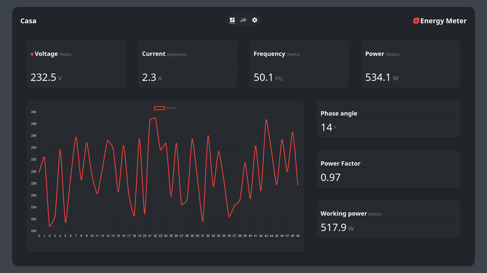

<!-- PROJECT LOGO -->
 

  

<h3 align="center">Energy meter</h3>

  

    Progetto per il percorso di PCTO 2021/2022
  

<!-- ABOUT THE PROJECT -->
## Il progetto

  

Cercando di collegare l'attività del PCTO con le tematiche trattate in educazione civica durante l'anno, ho deciso di sviluppare un sistema in grado di monitorare i parametri necessari per mostrare all'utente in modo semplice lo stato dell'impianto elettrico della propria abitazione e lo storico dei consumi, con l'obiettivo di incentivare un utilizzo più consapevole dell'energia elettrica.

Il progetto unisce in unico pacchetto tutte le funzionalità di seguito riportate e analizzate nello specifico successivamente.

* MISURA DELLE PRINCIPALI GRANDEZZE DI UN IMPIANTO ELETTRICO
* CALCOLO DELLA POTENZA E DEL FATTORE DI POTENZA
* VISUALIZZAZIONE DEI DATI IN TEMPO REALE
* GRAFICI INTERATTIVI

## Altre tecnologie e software utilizzati

* [MicroPython](https://micropython.org/)
* [Kicad](https://www.kicad.org/)
* [VSCode](https://code.visualstudio.com/)
* [MicroWebSrv2](https://github.com/jczic/MicroWebSrv2)
* [Charts.js](https://github.com/chartjs/Chart.js)

## Presentazione per l'esame di stato

  
  Premere sul logo per vedere la presentazione

